# monitorando-backup-windows-email
Monitorando Backup via E-mail no Windows Server
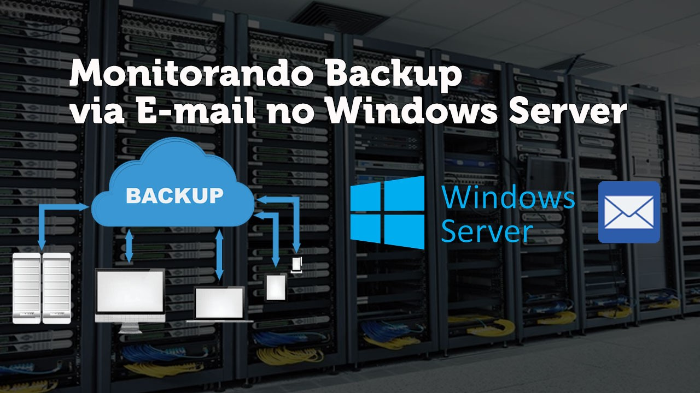

A segurança da informação é essencial para garantir a confiabilidade, integridade e disponibilidade da infraestrutura de qualquer empresa. Um sistema de backup eficiente é o mínimo esperado em qualquer ambiente corporativo.

Um bom administrador de sistemas tem a responsabilidade de adotar políticas de segurança, seguindo boas práticas e normas, e, sobretudo, garantir a existência de um sistema de backup robusto. Dada a amplitude da área de TI, pode ser desafiador monitorar todo o ambiente constantemente. Para facilitar essa tarefa, podemos utilizar o e-mail como uma ferramenta de monitoramento das rotinas de backup. Imagine receber no celular uma notificação informando quando um backup foi realizado com sucesso ou se houve uma falha. Maravilhoso, não é?

Vamos, então, implementar o monitoramento de backups em um servidor Windows.

Introdução
Cada evento que ocorre no Windows gera um ID, que representa uma ação, erro, entre outros. Quando um backup é gerado, ele também cria um ID correspondente. Vamos criar uma tarefa para que, sempre que esse ID específico for gerado, o Windows execute um script .bat, que, por sua vez, acionará um script PowerShell.

Vamos colocar a mão na massa!

**PRIMEIRA ETAPA**
*Configurando Script* 
*1º - Faça o Download do Script* - Link (Se não quiser baixar os arquivos, abra o Windows PowerShell ISE e digite o script como está na imagem abaixo e salve com o mesmo nome)*
*2° - Coloque a Pasta Script dentro da partição Disk Local (C:)*
*3° - Reserve 2 contas de e-mail, uma para enviar e outra para receber.*
*4° - A mesma configuração do arquivo Backup_ok.ps1 será feita no Backup_problema.ps1, a única alteração vai ser a mensagem e titulo dizendo OK ou ERROR, ou outra mensagem que você preferir.*

Dentro da pasta, vc vai encontrar os seguintes arquivos, 2 powershell e 2 bat.

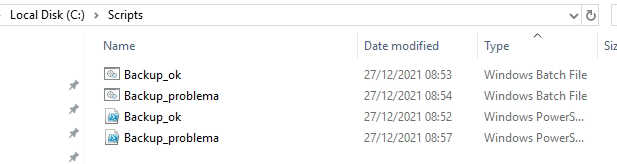

**Explicação:** Os arquivos Powershell possuem o script para logar no e-mail e enviar o email, nele podemos ajustar para qual e-mail enviar, Nome do título, mensagem do e-mail etc...
O Bat será utilizado para executar o script Powershell.

Para visualizar ou editar, vc pode clicar com o botão direito do mouse e ir em editar.

Vamos abrir o arquivo powershell *Backup_problema.ps1*

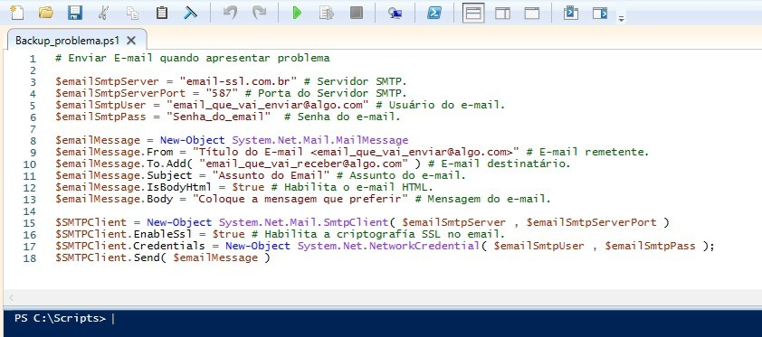

Não foi fornecido texto alternativo para esta imagem

Os próprios comentários do script já dizem tudo. 

**$emailSmtpServer** = "email-ssl.com.br" É o servidor SSL do seu e-mail, no meu caso, eu coloquei o da Locaweb.

**$emailSmtpServerPort** = "587"  Porta do Servidor SSL, coloque a porta que seu provedor de e-mail utiliza.

**$emailSmtpUser** = "email_que_vai_enviar@algo.com" Coloque o e-mail que irá enviar a mensagem.

**$emailSmtpPass** = "Senha_do_email" Senha do seu e-mail

**$emailMessage.From** = "Título do E-mail <email_que_vai_enviar@algo.com>" Coloque o Título do e-mail e depois o email que vai enviar, conforme a imagem mostra.

**$emailMessage.To.Add** =( "email_que_vai_receber@algo.com" ) E-mail que vai receber os alertas.

**$emailMessage.Subject** = "Assunto do Email" Assunto do e-mail.

**$emailMessage.Body** = "Coloque a mensagem que preferir" Mensagem do e-mail.

Pronto, só usar essas configurações e o script já será capaz de mandar e-mails. Se acaso não conseguir enviar, entre em contato com seu provedor de e-mail e peça os dados descritos.

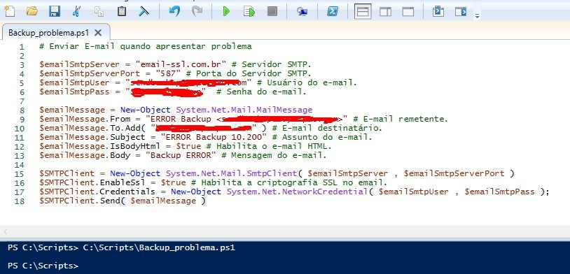

**5º - Agora que preenchermos o script Backup_problema.ps1 com seus dados, faça o mesmo com o Backup_ok.ps1, mude só a mensagem para SUCESSO ou algo que preferir.**

**Vamos realizar um teste, preenchi meu script com minhas informações e mensagem do e-mail. Vamos supor que meu backup apresentou um erro, se eu aperta o botão de Play, o script terá que executar e mandar um e-mail para o destinatário. Vamos testar.**

1º - Aperte o botão Verde de play

2º - Se no console não apresentar nenhuma mensagem de erro, o e-mail foi enviado com sucesso, vamos verificar!

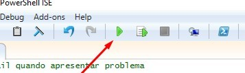

3º - E-mail Recebido com sucesso, faça o teste com os 2 arquivos.

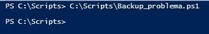

Agora vamos a última etapa.

Criando tarefas para envio automático de E-mail.

Vamos verificar os arquivos .bat

Abra os arquivos com algum editor de texto, eles têm que estar conforma a imagem abaixo. Caso mude a pasta Script para outro loca, deverá alterar a URL dos arquivos.

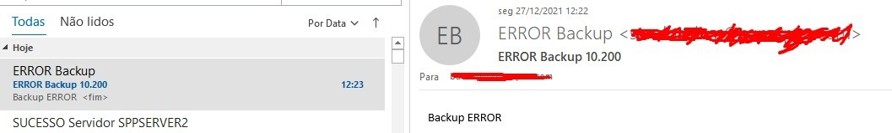
.bat ok, vamos agora criar as tarefas.

1º - Abra o Agendador de tarefas ( Task Scheduler)

2º - Vá em Biblioteca do Agendador ( Task Scheduler) e depois click em Criar Tarefa (Create Task)

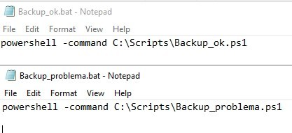

3º - Vamos criar 2 tarefas, 1 para mandar o e-mail de backup sucesso e outra com o e-mail backup error.

Vamos por o nome da tarefa de Notificação Backup Sucesso

Marque Executar estando com usuário conectado ou não

Marque Executar com privilégios mais altos

em Configurar para: Coloque o Seu S.O

4º - Click em Disparadores
Iniciar a tarefa: escolha Em um Evento
Log: escolha Microsoft-Windows-Backup/Operacional
Origem: Backup
Id do evento: 4

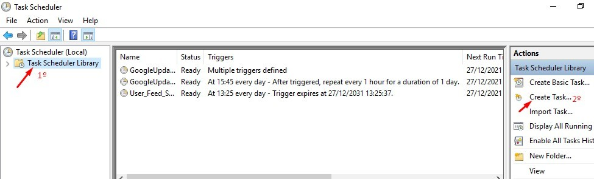

Quando o Windows realiza o backup, ele emite um evento de ID 4, por isso iremos utiliza-lo. Assim, sempre que que o sistema ler o ID 4, irá disparar a task, a task vai executar o .bat que irá executar o PowerShell e mandar o e-mail.

5º - Em Ação.
Escolha Ação: Iniciar um programa
Em Procurar, navegue até pasta Scripts e escolha o Arquivo Backup_ok.bat
Em Start, coloque C:\Scripts

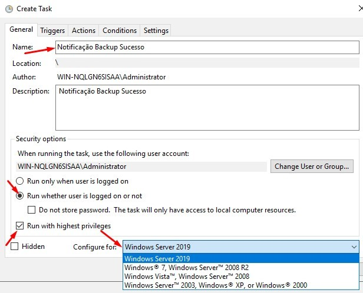

6º - Em Condições, Desmarque todas as opções.

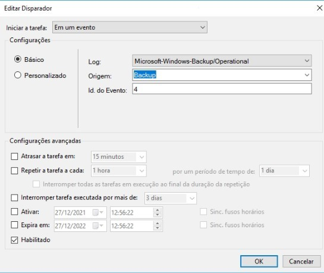

7º - Em Configurações, Marque somente Permitir que a tarefa seja executada por demanda.
E escolha Executar uma nova instância em paralelo

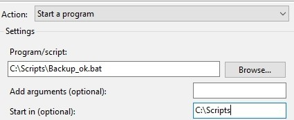

Tudo configurado, de OK e Pronto, Ação configurada.
Para testar, basta ir na tarefa e escolha a opção Executar (RUN) e logo em seguida verifica o e-mail! =)

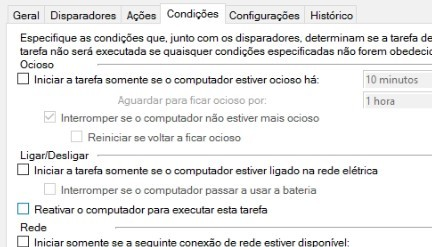

Agora que configuramos a taks para envio do Backup_ok, vamos configurar o Backup_problema.
Vamos fazer simplesmente a mesma coisa da última etapa.

1º - Criar Tarefa
2º - Guia Geral, vamos por o nome de Notificação ERROR Backup.
Marque a opção Executar estando o usuário conectado ou não, marque também Executar com privilégios mais altos. em Configurar Para: coloque o seu S.O
3º - Disparadores.
Iniciar a tarefa: Em um Evento.
Log: Microsoft-Windows-Backup/Operacional
id do evento: 5
De OK para salvar
Agora, teremos que adicionar mais Disparadores.
Quando um Backup apresenta algum erro, esse erro pode ser de diferentes fatores, erro de software, Disco ou local de backup desconectado etc... cada erro gera um evento com ID distinto, então vamos adicionar vários ID diferentes que representam problemas diferentes.
Ids utilizados para problema: 5, 19, 9, 49, 517, 561, 20.
Adicione todos os Disparadores da mesma forma, alterando somente os Ids, até ficar assim:

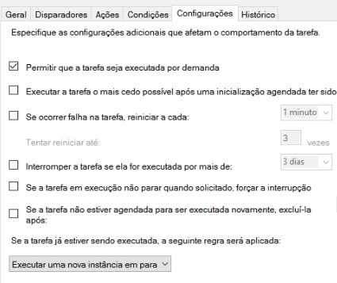

Feito isso, continue configurando a TAKS da mesma forma que fizemos na outra TAKS.
4º - Ações, click em NOVO 
Ação: Iniciar um programa
PROCURAR: navegue até pasta Scripts e escolha o Arquivo Backup_problema.bat
Em Start, coloque C:\Scripts
5º - Condições - Desmarque todas as opções.
6º - Configurações - Marque somente Permitir que a tarefa seja executada por demanda e escolha Executar uma nova instância em paralelo.

De OK para salvar e pronto!
